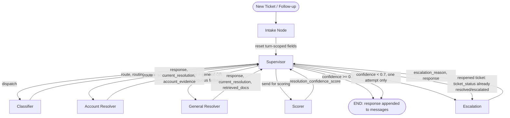

# UDA-Hub — Multi-Agent Architecture Design

## 1. Overview

UDA-Hub is a Universal Decision Agent that plugs into support platforms (Zendesk,
Intercom, Freshdesk, internal CRMs) and resolves customer support tickets for
connected accounts. The first connected account is **CultPass**, a cultural
experiences subscription service.

**Inputs:**
- Incoming support ticket (text content + metadata: status, date, tags, channel)
- Internal knowledge base (CultPass support articles)
- Tools for account-specific lookups (CultPass database)
- Memory store (short-term session context, long-term per-user history)

**Output:** A resolved or escalated ticket, with a structured, auditable trail of
every decision made along the way.

---

## 2. Architecture Pattern & Justification

UDA-Hub uses the **Supervisor pattern**.

The Supervisor pattern mirrors how real-world support and ticketing systems
operate — a central supervisor assigns tickets to the appropriate agent, reviews
outcomes, and escalates when needed. A Hierarchical pattern (e.g., teams of
Resolvers, teams of Escalation agents) was considered but adds unnecessary
complexity for a single-account system like CultPass at this stage. A Network
pattern was ruled out because peer-to-peer handoffs make it difficult to produce
a single, coherent decision trail.

Because a dedicated Classifier agent already performs the reasoning needed to
determine a ticket's route, the Supervisor itself is implemented as a
**deterministic router** rather than an LLM-reasoning agent — it branches on
structured fields (`route`, `resolution_confidence_score`) that specialist
agents have already computed, avoiding a redundant LLM call at every hop. This
also means every agent reports back to a single orchestration point, giving the
system a centralized, inspectable log of decisions by construction.

---

## 3. Agents

| Agent | Role | Reads | Writes |
|---|---|---|---|
| **Classifier** | Classifies the ticket, determines routing, and assesses urgency from content + metadata | ticket content, metadata (date, tags, channel) | `route`, `routing_reason`, `urgency`, `ticket_status`, `decision_log` |
| **Account Resolver** | Resolves queries requiring lookup of *this specific user's* CultPass data (tools: CultPass DB). Dispatched by Supervisor when `route = "account"`. | `ticket_data`, `user_id`, `user_history` (appended to ticket content as personalization context, not grounding evidence) | `response`, `current_resolution`, `account_evidence`, `ticket_status`, `decision_log` |
| **General Resolver** | Resolves queries answerable from shared knowledge (tools: Knowledge-article RAG). Dispatched by Supervisor when `route = "general"`. Not user-specific — no `user_id` injection needed. | `ticket_data`, `user_history` (appended to ticket content as personalization context, not grounding evidence) | `retrieved_docs`, `response`, `current_resolution`, `ticket_status`, `decision_log` |
| **Scorer** | Evaluates the resolver's answer against whichever evidence type is present for the ticket | `ticket_data`, `response`, `retrieved_docs`, `account_evidence` | `resolution_confidence_score`, `decision_log` |
| **Escalation** | Handles low-confidence/failed cases, prepares handoff to human support | `ticket_data`, `response` | `escalation_reason`, `response`, `ticket_status`, `decision_log` |
| **Supervisor** | Deterministic orchestrator; routes tickets, fetches long-term memory, finalizes the reply | all state | routing branches, `user_history` (fetch), `ticket_status` (on resolution), final `messages` write |

Account Resolver and General Resolver are **mutually exclusive** per ticket —
each ticket is handled by exactly one of the two.

---

## 4. State Schema

| Field | Purpose |
|---|---|
| `messages` | Conversational message history (checkpointed per session) |
| `ticket_status` | Status of ticket resolution: `open → in_progress → resolving → resolved` / `escalated`. `resolving` marks that a Resolver has produced an answer not yet validated by Scorer. |
| `ticket_data` | Ticket information: metadata, user info, and the user's query |
| `thread_id` | Unique conversation identifier, used to retrieve session state later |
| `user_id` | The CultPass user this ticket belongs to; used for account-specific tool lookups (Account Resolver) and long-term memory retrieval (Supervisor) |
| `resolution_confidence_score` | Confidence score of the proposed resolution; drives escalate-or-close decision |
| `retrieved_docs` | Knowledge-article RAG results used to ground factual answers. Populated by extracting real `ToolMessage` results from `search_knowledge_base`'s tool calls (not the LLM's self-reported `sources_used`), giving Scorer actual article content to verify against. Stored as `List[str]` — each entry is the raw serialized tool-call output (title, content, tags for up to 5 articles per call), not split into individual per-article entries — see Future Work. |
| `account_evidence` | Raw tool-call results from Account Resolver's CultPass DB tools (`dict[str, list[str]]`, keyed by tool name), used by Scorer as the account-side counterpart to `retrieved_docs`. Populated by extracting `ToolMessage` results directly, not the LLM's self-report — giving Scorer independently verifiable evidence for account-routed tickets. |
| `escalation_reason` | Reason the ticket was escalated |
| `route` | Which resolver the ticket is routed to |
| `routing_reason` | Why the Classifier assigned this route |
| `decision_log[]` | Structured trail of `{agent, action, result}` entries capturing every agent's step and tool usage |
| `user_history` | Per-user personalized history retrieved via semantic search over past tickets |
| `response[]` | Internal, agent-appended draft answers as the ticket moves through Resolver/Escalation; the final entry is appended to `messages` by Supervisor before ending the graph |
| `current_resolution` | Non-accumulating (plain "replace") counterpart to `response`, set by whichever Resolver ran this turn. Reset to `None` by Intake Node on every invocation; used as a turn-scoped signal ("did a resolver produce output this turn") since `response`'s accumulating history can't distinguish this turn's output from a prior turn's on the same `thread_id`. |
| `urgency` | `"normal"` or `"high"`, assessed by Classifier from ticket content and metadata (date, tags, channel). Drives an adaptive confidence threshold in Supervisor: high-urgency tickets require `>= 0.85` confidence to resolve automatically (vs. the default `0.7`), since a shaky answer to an urgent issue is riskier than to a routine one. Directly exercises the rubric's "routing logic considers ticket metadata (urgency)" requirement. |

---

## 5. Flow Diagram



**Notes:**
- **Intake Node** runs first on every invocation, new or follow-up. It resets
  turn-scoped decision fields (`route`, `resolution_confidence_score`,
  `escalation_reason`, `retrieved_docs`, `account_evidence`,
  `current_resolution`) to their empty/`None` state. This is required because
  LangGraph's checkpointer restores the *entire* previous state for a given
  `thread_id` — without this reset, phase-detection logic in Supervisor would
  see stale fields from a prior turn and either terminate early or loop.
  `ticket_status` is deliberately *not* reset, since it is the signal used to
  detect a reopened ticket (see Section 6).
- `current_resolution` is a non-accumulating field (unlike `response`, which
  uses an `operator.add` reducer) set by whichever Resolver ran, used purely
  as a turn-scoped "a resolver just produced output" signal for routing.
- Supervisor fetches `user_history` (semantic search) immediately after
  Classifier reports back, before dispatching to a Resolver, so relevant
  context can be injected into the Resolver's tools.
- The "ambiguous fallback" label reflects a decision made by the **Classifier**
  (defaulting to `general` when it cannot confidently determine a route), not
  logic owned by Supervisor.

---

## 6. Routing & Escalation Logic

**Routing rule:** Classifier routes based on whether resolving the ticket
requires looking up *this specific user's* data in the CultPass database, versus
answering from general knowledge/policy that is the same for any user.
- **Account Resolver:** subscription tier/status lookups, account-blocked or
  authentication issues tied to their specific record, reservation history
  specific to them.
- **General Resolver:** pricing info, how-to/policy questions (e.g. password
  reset steps, booking process, facility info, app navigation) — anything
  answerable the same way for any user.

**Ambiguous fallback:** Defaults to General Resolver. This is the safer default
because General Resolver only answers from shared knowledge, whereas Account
Resolver acts on real user-specific data — a misroute there risks acting on or
exposing the wrong account's information.

**Escalation threshold:** Fixed threshold — `resolution_confidence_score < 0.7`
triggers escalation.

**One-attempt policy:** There is no retry loop back to a Resolver on low
confidence. A single low-confidence result routes directly to Escalation. This
bounds cost and latency and avoids runaway loops between Resolver and
Supervisor.

**Reopened ticket detection:** On a new incoming message for an existing
`thread_id`, the mechanism works as follows:
1. **Intake Node** (the graph's entry point) resets all turn-scoped decision
   fields (`route`, `resolution_confidence_score`, `escalation_reason`,
   `retrieved_docs`, `account_evidence`, `current_resolution`) to empty/`None`
   on every invocation — but deliberately leaves `ticket_status` untouched.
2. `submit_ticket()` only seeds `ticket_status: "open"` for a genuinely new
   ticket (no `thread_id` supplied by the caller); on a follow-up call (an
   existing `thread_id` is passed), it omits `ticket_status` from the input
   entirely, so the checkpointer's restored value from the prior turn survives.
3. Supervisor's routing function checks fields in order from most-recently-set
   to least (`escalation_reason` → `resolution_confidence_score` →
   `current_resolution` → `route` → fallback). On a follow-up, all of these
   are freshly reset to empty by Intake, so control falls through to the final
   fallback check: if `ticket_status` is already `resolved` or `escalated`
   (surviving from the prior turn), the message is routed directly to
   Escalation — bypassing Classifier, Resolver, and Scorer entirely.

This is a deterministic state check, not an LLM decision, consistent with
Supervisor's role as a non-reasoning router. Escalation's own reasoning still
has access to the *prior* resolution (via the accumulated `response` field,
which is never reset) so it can reference what was already attempted when
composing its handoff note. If the ticket was already `escalated` once, a
repeat message re-escalates again for now (no special handling of
double-escalation); a predefined "already with our support team" response is
left as a Future Work item rather than solved now.

**Why the reset is necessary:** LangGraph's checkpointer restores the entire
previous `State` for a given `thread_id`, not just `messages`. Without Intake
Node's reset, fields like `route` or `response` would still hold values from
the *previous, already-completed* turn, causing Supervisor's phase-detection
to either terminate immediately (mistaking old results for new) or, worse,
re-loop through the same Resolver indefinitely (this was an actual bug
encountered and fixed during development — see `current_resolution`'s role
in Section 4).

---

## 7. Memory Design

The system implements two distinct scopes of memory, corresponding to
LangGraph's short-term/long-term distinction:

**Short-term (session) memory** is handled via `thread_id` and LangGraph's
checkpointer. It persists `messages` — the clean, user-facing conversational
history — across turns within the same ticket/session, giving any node access
to what has actually been said so far without needing to re-derive context.

**Long-term (cross-session) memory** is personalized per user and implemented
via semantic search over that user's past ticket history, rather than a simple
structured query. It is fetched by Supervisor — not by individual Resolvers —
immediately after Classifier reports back a route, so relevant history can be
injected into whichever Resolver is dispatched next. Retrieval is
similarity-based and only injected into `user_history` when something relevant
is actually found, avoiding noise on tickets with no meaningful prior history.
This is deliberately kept in a separate state field (`user_history`) from
`retrieved_docs`, since the two serve different purposes: one supports
personalization, the other supports factual grounding.

---

## 8. RAG Design

The system implements **two separate retrieval systems**, intentionally kept
distinct in both state and logic:

1. **Knowledge-article RAG** (General Resolver's tool): retrieves relevant
   support articles from the `Knowledge` table in `udahub.db` based on the
   ticket's content, to ground factual/policy answers. Results populate
   `retrieved_docs`. This is the system Scorer evaluates against — checking
   whether the resolver's answer is actually supported by the retrieved
   article(s), rather than judging prose in isolation.
2. **Long-term memory semantic search** (Supervisor's fetch): retrieves the
   *same user's* past ticket/resolution history via similarity search, for
   personalization rather than factual grounding. Results populate
   `user_history`.

Keeping these separate avoids conflating "what does policy say" with "what has
this user experienced before" — both in the data flowing through the graph and
in how each is logged/audited.

**Scorer's evidence handling:** Scorer evaluates a resolver's answer against
whichever of two mutually-exclusive evidence types is present for a given
ticket — `retrieved_docs` (Knowledge-article RAG, populated by General
Resolver) or `account_evidence` (raw CultPass DB tool-call results, populated
by Account Resolver). Both are extracted directly from tool-call results, not
from the resolver's self-reported summary, and Scorer's prompt is explicit
that either form counts as valid grounding — an empty `retrieved_docs` on an
account-routed ticket (or vice versa) is expected, not a sign of missing
evidence. This resolved an early bug where Scorer penalized correct,
DB-grounded account answers for lacking KB articles, which were never
relevant to that ticket in the first place.

---

## 9. Logging & Observability

`messages` is reserved strictly for conversational content — what the user and
the AI have actually exchanged — since that's what gets checkpointed and read
back as context in future turns.

All internal agent activity is instead captured in `decision_log[]`, a
structured trail of `{agent, action, result}` entries appended by every node as
the ticket moves through the graph — including tool calls, classification
outcomes, routing decisions, and scoring results. This separation exists
because `messages` is optimized for LLM consumption (conversational coherence),
while `decision_log` is optimized for human/grader inspection: structured,
filterable, and queryable (e.g., "show every ticket where Scorer confidence
fell below 0.7") in a way that parsing conversational text never cleanly
supports.

---

## 10. Setup & Run Instructions

**Environment:**
1. Create and activate a virtual environment:
   ```bash
   python3 -m venv venv
   source venv/bin/activate   # Windows: venv\Scripts\activate
   ```
2. Install dependencies: `pip install -r requirements.txt`
3. Ensure a `.env` file exists at the project root with `OPENAI_API_KEY` and
   `BASE_URL` set.

**Database & index setup (run once, in order):**
1. `01_external_db_setup.ipynb` — creates `data/external/cultpass.db` and
   seeds CultPass users, subscriptions, experiences, reservations.
2. `02_core_db_setup.ipynb` — creates `data/core/udahub.db`, seeds the
   `cultpass` Account, the Knowledge base (19 support articles), and one
   demo ticket.
3. `python build_indexes.py` — builds the Chroma knowledge-base index
   (`build_knowledge_index()`) and the long-term user-history index
   (`build_user_history_index()`, expected to report "no data to index" on a
   fresh setup, since no tickets have been processed yet).

**Running the app:**
```bash
python 03_agentic_app.py
```
This runs all 7 test scenarios (general resolution, account resolution x2,
ambiguous fallback, escalation on no KB match, a reopened-ticket pair, and a
returning-customer memory-retrieval case) and prints each ticket's query,
routing decision, urgency, confidence, final answer, and full decision log.

**Re-running the memory scenario meaningfully:** since `build_user_history_index()`
is a full rebuild (not incremental), re-run `python build_indexes.py` after a
`03_agentic_app.py` run has persisted new tickets, before re-running the app,
to pick up newly resolved tickets in `user_history` retrieval.

**Resetting test data between runs (optional):** tickets persisted to
`udahub.db` accumulate across runs. To start clean, see `reset_test_data()`
(clears `Ticket`/`TicketMetadata`/`TicketMessage` rows and the user-history
Chroma directory; leaves `cultpass.db` and the knowledge-base index untouched).

**Note on `03_agentic_app.ipynb`:** this notebook was used for iterative
development and flow testing prior to the code being modularized into the
`agentic/` package. It does not reflect the final, integrated implementation —
`03_agentic_app.py` and the `agentic/` package has the final,
up-to-date code.

---

## 11. Future Work

- `retrieved_docs` holds the raw serialized `ToolMessage.content` from
  `search_knowledge_base` calls — real article content (title, content,
  tags), not self-reported titles. However, it is not flattened/parsed into
  individual per-article `Document`/dict entries — each list entry is a
  single stringified blob potentially containing up to 5 articles from one
  tool call. A future iteration should parse this (e.g., via `ast.literal_eval`
  or a `content_and_artifact`-based tool response) into structured per-article
  entries, both for cleaner downstream consumption and to avoid relying on
  Python's repr-style string serialization.
- `persist_ticket` creates a new `Ticket` row on every terminal graph pass,
  rather than one `Ticket` per logical conversation thread. A reopened ticket
  (same `thread_id`, escalated a second time) currently persists as two
  unlinked `Ticket` records rather than one updated record, since `Ticket`
  has no `thread_id` column to look up against. Fixing this would require a
  schema change (`thread_id` on `Ticket`) plus updating `persist_ticket` to
  find-or-update rather than always insert, and `build_user_history_index`'s
  one-question/one-answer-per-ticket assumption to support multiple message
  pairs per ticket.
- On repeated messages to an already-escalated ticket, return a predefined
  "your ticket is already with our support team" response instead of
  re-running the Escalation LLM call each time.
- Extend urgency detection beyond a binary normal/high signal (e.g., a
  numeric scale, or explicit weighting by channel/date staleness) and
  consider using it in routing itself, not just the confidence threshold.
- Evaluate resolver output quality using RAGAS-style reference-based metrics
  instead of (or alongside) Scorer's current approach, once a labeled
  evaluation set exists.
- Extend routing beyond binary Account/General if new ticket categories emerge
  (e.g., a dedicated Billing Resolver), following the Hierarchical pattern
  considered and deferred in Section 2.

---

## 12. AI Tools Used
- **Claude** — Design and drafting of the architecture document (structure,
  tables, diagrams, and rephrasing), agent prompt refinement, code review and
  debugging support throughout implementation, and generation of supporting
  scripts (`sample_tickets.py`, `retest_test.py`).
- **Gemini** — Bug fixes and generation of sample CultPass knowledge-base
  articles.